# GLC v1 — Modal Pen-Testing Deployment

GLC v1 is a gateway that sits between agent clients and LLM providers, plus
channel adapters (Telegram, WhatsApp, webhooks, a web UI, ...) and voice
providers (STT/TTS). This repo is a clone of that gateway wrapped for
deployment on [Modal](https://modal.com) and treated as a live, attackable
target for a security assignment: reproduce every known finding against a
real deployment, harden the gateway against them, then hunt for new bugs.

Everything below documents what's actually been done in **this** clone —
what surfaces exist, what's been broken and fixed, how the eight invariants
and four attacker roles are used to reason about severity, and how to run
the local testing dashboard that automates every repro.

## Attacker model

Findings are rated by which of four attacker roles can reach them — weakest
to strongest:

| Role | Who they are |
|---|---|
| `AR1` | An outsider on the public internet with no credentials |
| `AR2` | A normal channel user who controls only the text they type |
| `AR3` | An attacker who has taken over a single adapter container |
| `AR4` | An attacker who has achieved code execution inside the gateway process |

A finding reachable by `AR1` is worse than an identical finding that
requires `AR4`, because `AR1` needs nothing but a network connection.

## Invariants

Every finding is also tied to which of eight security invariants it
violates:

| Code | Invariant |
|---|---|
| `INV-1` | Adapters must never see provider API keys. |
| `INV-2` | Every action must be checked against the actual user, tenant, and final arguments. |
| `INV-3` | External content must always be treated as data, never as instructions. |
| `INV-4` | A credential must work only for one specific tool call. |
| `INV-5` | Each tenant must have separate memory, and every stored fact must record its source. |
| `INV-6` | Dangerous or high-impact actions must be approved with their final parameters. |
| `INV-7` | Components must not be able to edit or delete their own audit logs. |
| `INV-8` | Every run must have hard limits on time, tokens, tool calls, and cost. |

## The findings console

`tools/findings_console/` is the dashboard that produced every
`before`/`after` verdict quoted in this README — a real, local web UI that
drives two live, separately deployed Modal apps (see [Deploying the
app](#deploying-the-app)) and records what actually happened. The
screenshots below are from the running dashboard; every value shown is a
real result against a real deployment, not a mockup.

### Configuring the two targets

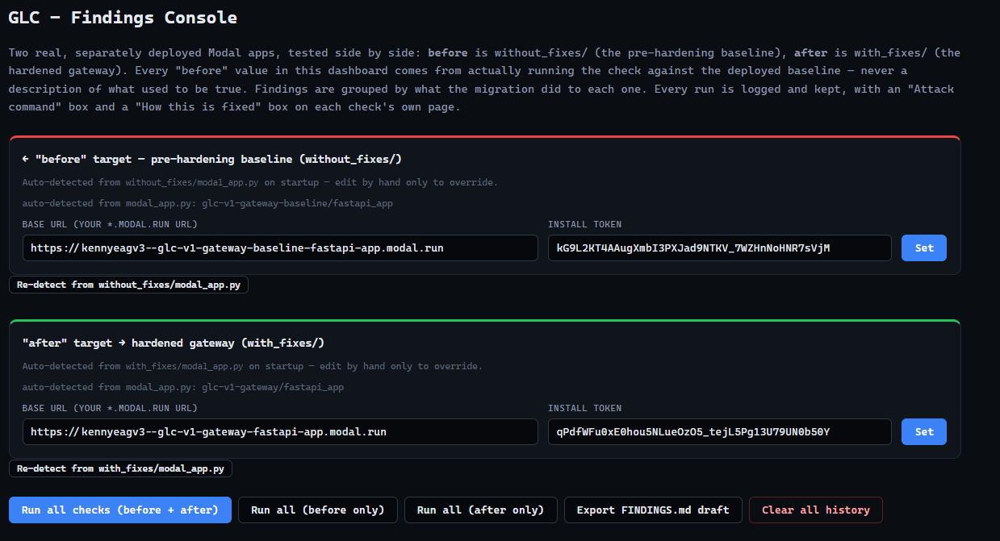

The top of the page has no findings on it yet — it's entirely about
pointing the dashboard at the two deployments it's about to test.
`without_fixes/` (outlined in red, "before") and `with_fixes/` (outlined
in green, "after") each get their own panel. On startup the console reads
that variant's own `modal_app.py`, resolves its App/Function/Volume
names, and asks the Modal SDK for the live `*.modal.run` URL and install
token directly — nothing to copy-paste. If a target ever needs
correcting (a redeploy under a different name, for instance), each panel
has its own **Re-detect** button. Below both panels sits the action bar:
**Run all checks (before + after)** fires every one of the 22 checks
against both deployments in one pass; **Run all (before only)** / **Run
all (after only)** run just one side; **Export FINDINGS.md draft** dumps
the full run log as a Markdown starting point; **Clear all history**
wipes every recorded run for every target.

### Section A — introduced or elevated by the migration

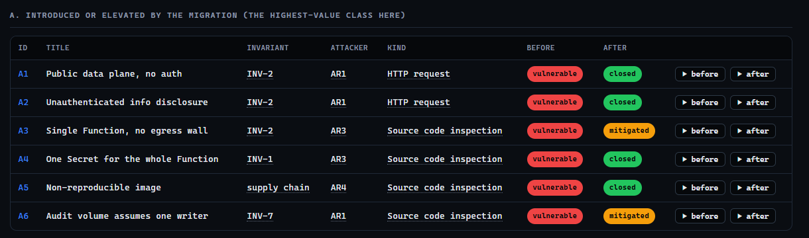

Each row is one finding: the invariant it breaks, the attacker role that
reaches it, what kind of check proves it (an HTTP request, a source-code
read, a live Modal probe, ...), and two verdict badges — **before**
(always `vulnerable` here) and **after** (`closed` or `mitigated`). The
**▶ before** / **▶ after** buttons on the right re-run that one check
against that one target on demand; clicking the finding ID opens its own
page with the full before/after evidence.

### Section B — inherited in-process leaks

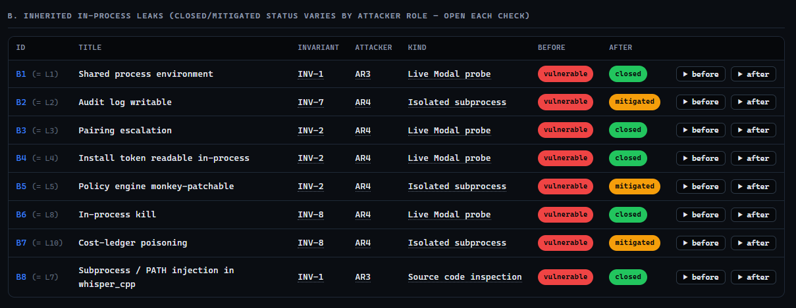

Same layout, for the ten in-process code leaks (aliased here as B1–B8,
skipping L6/L9 since those are the same bugs as A3/C2). Notice the `KIND`
column alternates between **Live Modal probe** (calls a real deployed
adapter-shaped Function and reports what it can actually observe) and
**Isolated subprocess** (runs in a throwaway local process that imports
the target's own `glc` package directly) — which kind applies depends on
whether the finding is about container/process separation or about
in-process code behavior.

### Section C — inherited endpoint/logic issues

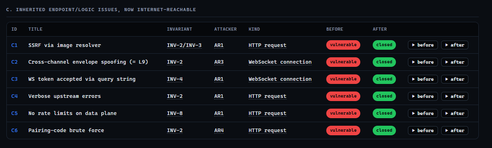

These six are bugs that existed in the code before Modal, but only became
attacker-reachable once the gateway got a public URL — every one of them
is exercised as an actual HTTP request or WebSocket connection against
the deployed target, not a local assumption.

### The canonical ten-leaks table

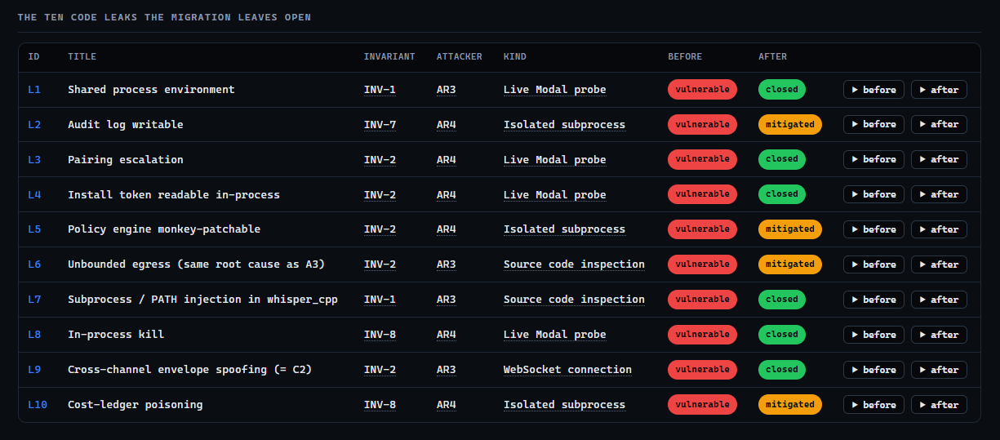

This is the same eight findings from Section B plus L6 and L9 shown under
their original assignment numbering (L1–L10) instead of the console's own
A/B/C regrouping — useful for cross-referencing against the assignment's
own finding IDs directly.

### Reference legend — verdict codes

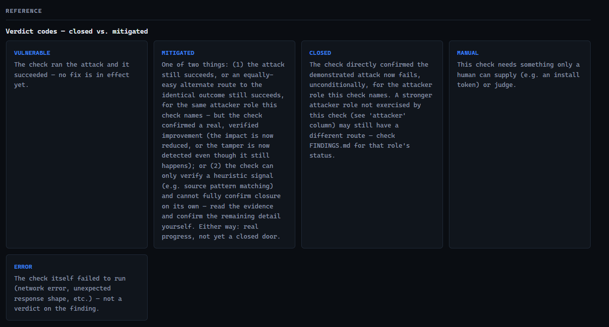

Every verdict badge in every table above is one of these five, and the
dashboard defines them inline so you never have to guess what "mitigated"
means relative to "closed": **vulnerable** (the attack ran and
succeeded, no fix in effect), **mitigated** (real, verified progress —
impact reduced or tampering now detected — but the same attacker still
has an equally-easy route to the same outcome, or the check can only
confirm a heuristic signal), **closed** (the check directly confirmed
the demonstrated attack now fails, unconditionally, for the attacker role
named — a *stronger* role not exercised by this check may still have a
different route), **manual** (needs something only a human can supply,
like an install token), **error** (the check itself failed to run — not
a verdict on the finding).

### Reference legend — invariants and attacker roles

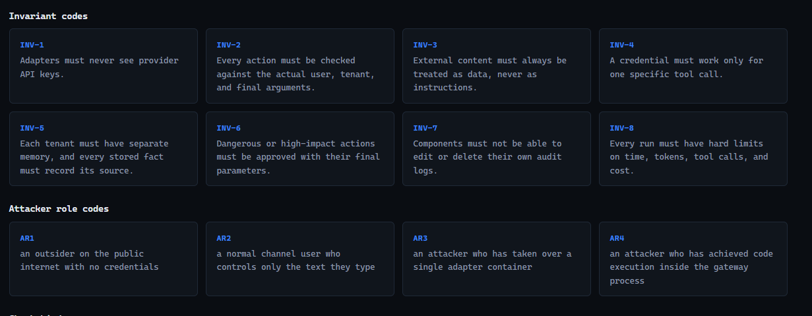

The same INV-1..INV-8 and AR1..AR4 codes used in every table above,
spelled out in full — hovering the underlined code in any table shows
the same text as a tooltip, so this legend is there for a full read
rather than a lookup.

### Reference legend — check kinds

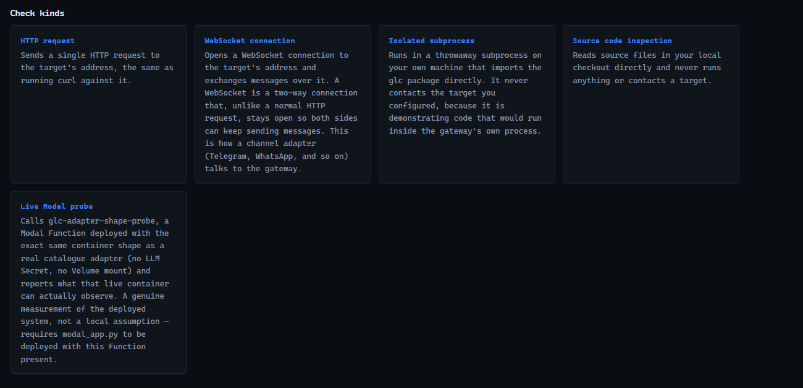

What each `KIND` column value actually does when you click **Run**: an
**HTTP request** is the same thing as running `curl` against the target;
a **WebSocket connection** opens a real two-way connection the way a
channel adapter talks to the gateway; an **isolated subprocess** runs
locally and imports the target variant's own `glc` package, never
touching the deployed target, because it's demonstrating code that would
run *inside* the gateway's own process; **source code inspection** reads
local files and never runs or contacts anything; a **live Modal probe**
calls `glc-adapter-shape-probe`, a Function deployed with the exact same
container shape as a real catalogue adapter, and reports what that live
container can actually observe — a genuine measurement, not a local
assumption.

### Check detail pages — three worked examples

Every finding ID in every table above is a link to its own page — the
same page the **Fix commit(s)** lines further down in this README are
describing in prose. Three examples below (`A1`, `C6`, `L4`), chosen to
show the three different check kinds: a plain HTTP request, an HTTP
request that needs the install token, and a live Modal probe.

#### A1 — Public data plane, no auth

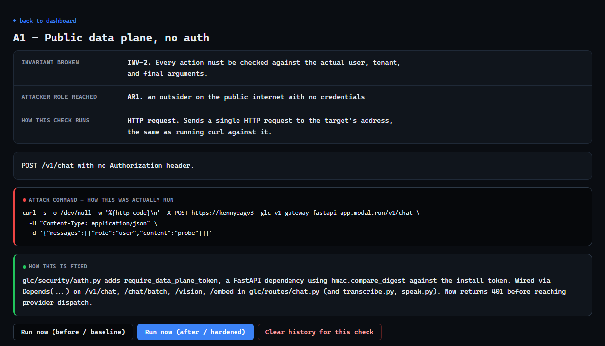

Above the fold: the invariant/attacker/kind detail list, a one-line
description of the exploit, the **Attack command** box (the literal
`curl -X POST .../v1/chat` with no `Authorization` header — copy-pasteable
against the live deployment), and the **How this is fixed** box naming
`require_data_plane_token` in `with_fixes/glc/security/auth.py` directly.
The three buttons at the bottom re-run this one check against either
target, or clear its history.

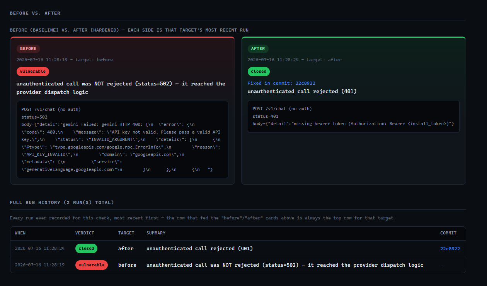

Below the fold: the real **before vs. after** comparison — `before`
reached all the way to a live provider call (the request wasn't rejected,
it just failed downstream with an invalid *mock* API key, which is itself
the proof there's no auth gate in front of it), `after` returns `401`
with a `missing bearer token` message before ever reaching provider
dispatch, stamped `Fixed in commit: 22c8922`. The **Full run history**
table underneath lists both runs chronologically — exactly two rows,
one per target, no duplication.

#### C6 — Pairing-code brute force

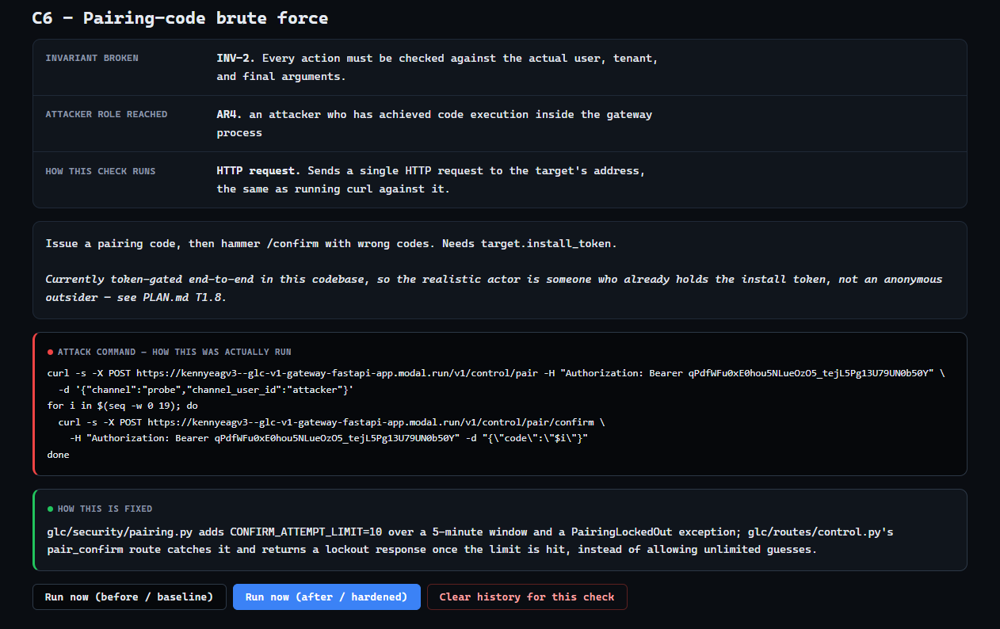

This check's `kind` is still an HTTP request, but one that needs
`target.install_token` to even get started (issuing a real pairing
request first) — the description box calls this out explicitly, since
`C6` is the one finding in this set that's "AR4-adjacent" rather than
reachable by an anonymous caller. The fix box names the exact mechanism:
`CONFIRM_ATTEMPT_LIMIT=10` over a 5-minute window in
`with_fixes/glc/security/pairing.py`.

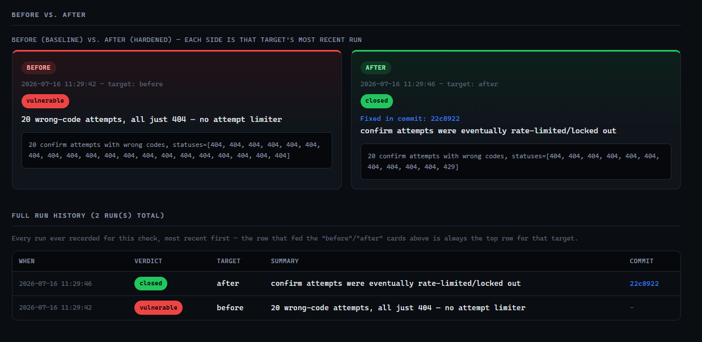

`before`: 20 wrong-code attempts in a row, every single one a plain `404`
— no attempt limiter at all. `after`: the same 20 attempts, but the
sequence ends in a `429` once the limiter trips — `confirm attempts were
eventually rate-limited/locked out`, `Fixed in commit: 22c8922`.

#### L4 — Install token readable in-process

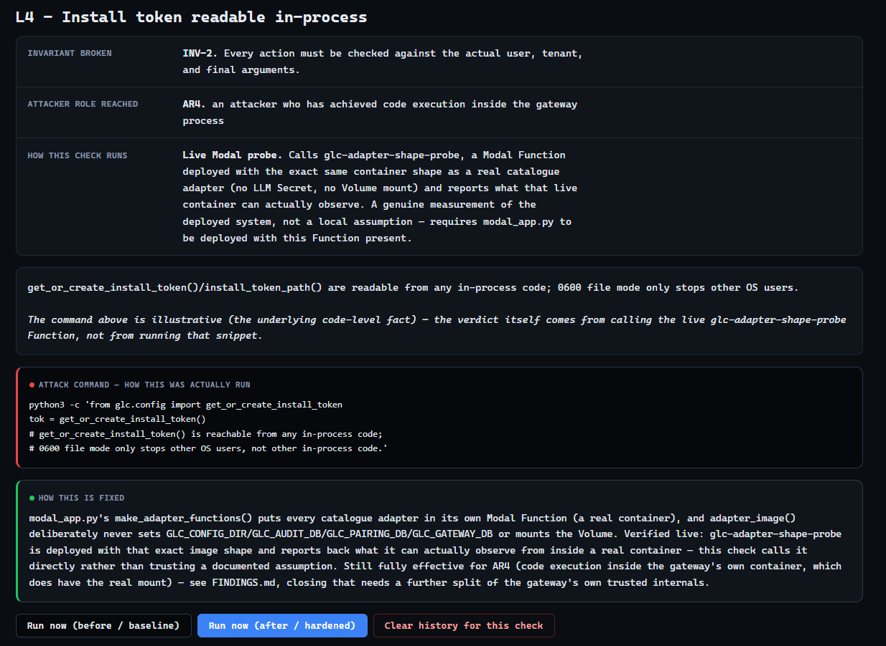

`L4`'s `kind` is **Live Modal probe** — the description box says so up
front, and explains that the attack command shown is illustrative only
(the actual verdict comes from calling the real deployed
`glc-adapter-shape-probe` Function, not from running that snippet
locally). The fix box explains the actual mechanism: every catalogue
adapter's container (`adapter_image()`/`make_adapter_functions()` in
`modal_app.py`) deliberately never mounts the Volume, so
`get_or_create_install_token()` can still run in there, but only ever
creates a throwaway token nobody else reads.

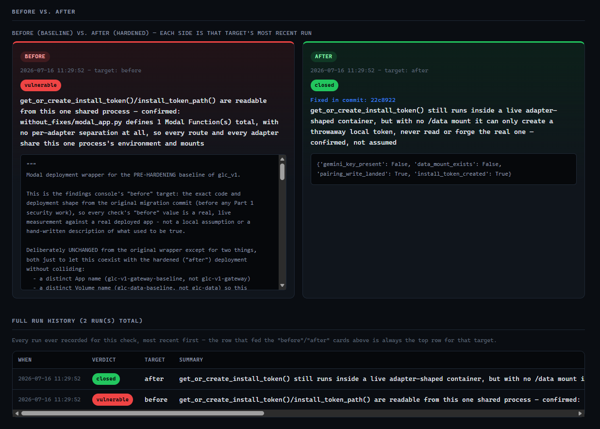

`before`: the baseline's `without_fixes/modal_app.py` defines exactly
one Modal Function total, so *every* route and adapter shares its one
process's environment — reading the install token from anywhere in that
process reaches the real one. `after`: the same call still runs inside a
live adapter-shaped container, but the evidence dict shows exactly why
it doesn't matter — `data_mount_exists: False` (no `/data` mount to read
the real token from at all), alongside `install_token_created: True`
(the call itself isn't blocked, it just can't reach anything real).

## Attack surface: the 22 known findings, in detail

Findings are grouped by *what the Modal migration did to each one* — this
is the same grouping the local testing dashboard and its export use. Every
finding below has its own commit and its own regression test — the short
hash after **Fix commit(s)** is `git show <hash>`-able directly in this
repo's own history (`git log --oneline` to see them in order); most
predate the later `with_fixes/` move (`7ffeb1b`), so `git show` on one of
them shows the file at its original bare `glc/...` path, not
`with_fixes/glc/...`. Everything else (location, before, fix, how it was
verified) is inline here too, so this README is self-contained —
`FINDINGS.md` remains the canonical version if the two ever drift.

### Section A — Introduced or elevated by the Modal migration

Deployment-level gaps that didn't exist, or didn't matter, before the
gateway was put on the public internet.

| ID | Finding | Invariant | Attacker |
|---|---|---|---|
| A1 | Public data plane, no auth — `/v1/chat`, `/chat/batch`, `/vision`, `/embed`, `/v1/transcribe`, `/v1/speak` accept requests from anyone | INV-2 | AR1 |
| A2 | Unauthenticated info disclosure — `/cost/by_agent`, `/providers`, `/capabilities`, `/status`, `/routers`, `/embedders`, `/calls`, plus `/docs`/`/openapi.json` left on | INV-2 | AR1 |
| A3 | Single Modal Function serving everything, no egress wall | INV-2/INV-3 | AR1/AR3 |
| A4 | One Modal Secret mounted to the entire Function — every route and every adapter can read every provider key | INV-1 | AR3 |
| A5 | Non-reproducible container image — hand-duplicated `pip_install` list instead of `uv.lock`, unpinned base image | supply chain | AR4 |
| A6 | Audit volume assumes a single writer — no `max_containers=1`, plain `sqlite3.connect()` with no cross-container coordination | INV-7 | AR1 |

#### A1 — Public data plane, no auth

- **Location:** `with_fixes/glc/routes/chat.py` (`/v1/chat`, `/chat/batch`, `/vision`, `/embed`), `with_fixes/glc/routes/transcribe.py`, `with_fixes/glc/routes/speak.py`
- **Invariant broken:** INV-2 — every action must be checked against the actual user
- **Attacker role reached:** AR1
- **Status:** fully closed

**Before:** none of the six data-plane routes had an auth dependency — an anonymous internet caller could drive LLM spend and abuse the pipeline with zero credentials.
**Fix:** `with_fixes/glc/security/auth.py`'s `require_data_plane_token` (constant-time `hmac.compare_digest` from the start), wired via `dependencies=[Depends(...)]` on all six routes.
**Fix commit:** `dce704d` — harden: require bearer-token auth on the data plane (A1)
**Verified:** `curl -X POST <url>/v1/chat -d '{"prompt":"hi"}'` now returns `401` instead of reaching provider dispatch — confirmed against the live Modal deployment, reproducible on demand via the console's A1 check.

#### A2 — Unauthenticated info disclosure

- **Location:** `with_fixes/glc/routes/chat.py` (`/cost/by_agent`, `/providers`, `/capabilities`, `/status`, `/routers`, `/embedders`, `/calls`); `with_fixes/glc/main.py` (`/docs`, `/openapi.json`, `/redoc`)
- **Invariant broken:** INV-2
- **Attacker role reached:** AR1
- **Status:** fully closed

**Before:** all seven read endpoints were open with no auth — free reconnaissance of provider order, rate limits, and usage. `/docs`/`/openapi.json` were FastAPI defaults, never disabled.
**Fix:** same `require_data_plane_token` dependency applied to all seven endpoints; `main.py` sets `docs_url`/`redoc_url`/`openapi_url` to `None` when `GLC_ENV=production` (set in the Modal image).
**Fix commits:** `4428d7e` — harden: gate info-disclosure endpoints, disable docs in prod (A2); `8ad9b94` — harden: set GLC_ENV=production in the Modal image (A2 follow-up)
**Verified:** live deployment — `/v1/status` returns `401` unauthenticated; `/docs` returns `404`.

#### A3 — Single Function, no egress wall

- **Location:** `with_fixes/modal_app.py`
- **Invariant broken:** INV-2/INV-3
- **Attacker role reached:** AR1/AR3
- **Status:** container separation fully closed (all 15 adapters); egress wall still only demonstrated for telegram

**Before:** one `@app.function` served the entire gateway plus every adapter — no `modal.Sandbox`, no egress control at all.
**What widened the scope:** every adapter under `with_fixes/glc/channels/catalogue/` turned out to have a real, working implementation, not an unimplemented stub — so there was no reason to leave any of them sharing the core gateway's LLM Secret.
**Fix:** every catalogue adapter now runs in its own Modal Function via `with_fixes/modal_app.py`'s `ADAPTER_SECRETS` mapping + `make_adapter_functions()`; the core gateway Function never imports adapter code in-process. Egress allowlisting via `modal.Sandbox` remains demonstrated only for telegram (Move D).
**Fix commits:** `b2d8306` — harden: per-adapter container + scoped Secret, telegram (Move B/C); `615605b` — harden: migrate all 15 catalogue adapters to per-adapter Functions + Secrets (Move B/C gateway-wide); `9ac4177` — harden: egress allowlist via Modal Sandbox, telegram (Move D)
**Verified:** `uv run modal run with_fixes/modal_app.py::verify_telegram_egress_allowlist` — a request to `api.telegram.org` succeeds, a request to `example.com` is blocked. The egress wall itself is **not** wired into the live per-request webhook dispatch path for any adapter, and the core gateway Function still needs open egress to reach LLM providers — that part stays "mitigated," not closed.

#### A4 — One Secret for the whole Function

- **Location:** `with_fixes/modal_app.py`
- **Invariant broken:** INV-1
- **Attacker role reached:** AR3
- **Status:** fully closed, all 15 adapters

**Before:** `llm_secret` mounted to the entire `fastapi_app` Function — every route and every adapter could read every provider key.
**Fix:** `ADAPTER_SECRETS` maps every one of the 15 catalogue adapters to its own Secret (`glc-discord-secret`, `glc-gmail-secret`, `glc-imap-secret`, `glc-line-secret`, `glc-matrix-secret`, `glc-signal-secret`, `glc-slack-secret`, `glc-teams-secret`, `glc-telegram-secret`, `glc-twilio-sms-secret`, `glc-twilio-voice-secret`, `glc-webhook-secret`, `glc-whatsapp-secret`, or `None` for `local_mic`/`webui`, which need no external credential) — never `glc-llm-keys`.
**Fix commits:** `b2d8306` — harden: per-adapter container + scoped Secret, telegram (Move B/C); `615605b` — harden: migrate all 15 catalogue adapters to per-adapter Functions + Secrets (Move B/C gateway-wide)
**Verified:** two throwaway probe Functions sharing the exact live secret configuration, read directly on Modal: the core gateway's probe (`glc-llm-keys` only) showed all six LLM keys present and zero of the twelve adapter credentials; a `slack`-scoped probe (`glc-slack-secret` only) showed its own token present and zero LLM keys, zero other adapters' credentials.

#### A5 — Non-reproducible image

- **Location:** `with_fixes/modal_app.py`
- **Invariant broken:** supply chain
- **Attacker role reached:** AR4 (arbitrary code execution via a poisoned dependency or shifted base image)
- **Status:** fully closed

**Before:** `pip_install([...])` hand-duplicated from `pyproject.toml`, ignoring `uv.lock`; base image `debian_slim(python_version="3.11")` unpinned.
**Fix:** `modal.Image.from_registry("python:3.11-slim@sha256:...")` (digest resolved via the Docker Hub registry API) piped into `.uv_sync(extra_options="--no-dev")`, which runs `uv sync --frozen` against this repo's own lock file.
**Fix commit:** `5db94f4` — harden: reproducible image build from uv.lock, pin base digest (A5)
**Verified:** redeployed to the live account — image builds clean from the pinned digest + `uv sync`, `/healthz` still returns `{"ok": true}`.

#### A6 — Audit volume assumes one writer

- **Location:** `with_fixes/modal_app.py`; `with_fixes/glc/audit/store.py`
- **Invariant broken:** INV-7
- **Attacker role reached:** not directly attacker-triggered — corruption risk grows with concurrent load, which any high-volume caller (AR1) can induce
- **Status:** mitigated (full closure needs a dedicated writer process or managed DB)

**Before:** `min_containers=0`, no `max_containers` limit; `audit.sqlite`/`gateway.sqlite` opened via bare `sqlite3.connect()` per call with no cross-container coordination.
**Fix:** `max_containers=1` pinned on the core gateway Function.
**Fix commit:** `6d9fd86` — harden: single-writer audit path (A6)
**Verified:** redeployed live, `/healthz` still returns `{"ok": true}`.

**A related bug found while re-verifying L3/L4/L8** (fix commit `f854e0a` — fix: route all four stores to the Volume; close L3/L4/L8 for AR3): `with_fixes/glc/audit/store.py`, `with_fixes/glc/security/pairing.py`, and `with_fixes/glc/db.py` each hardcoded their own `~/.glc` default and only honored their own specific env var (`GLC_AUDIT_DB`, `GLC_PAIRING_DB`, `GLC_GATEWAY_DB`) — only `with_fixes/glc/config.py`'s `CONFIG_DIR` actually derived from `GLC_CONFIG_DIR`. Since `with_fixes/modal_app.py` only ever set `GLC_CONFIG_DIR`, `audit.sqlite`, `pairings.sqlite`, and `gateway.sqlite` were **never landing on the Volume at all** — they silently fell back to the container's own ephemeral filesystem and were wiped on every cold start. Confirmed directly: `modal volume ls glc-data glc` showed only `glc/install_token`, despite the deployment having handled real traffic for the entire session. Fixed by explicitly setting all four paths (`GLC_CONFIG_DIR`, `GLC_AUDIT_DB`, `GLC_PAIRING_DB`, `GLC_GATEWAY_DB`) to `/data/glc/...` on the core gateway's image. **Verified:** made a real request, confirmed `modal volume ls` now lists all four files; pulled `gateway.sqlite` locally, confirmed a `calls` row, redeployed, pulled it again, confirmed the same row survived the redeploy.

### Section B — The ten in-process code leaks

The console additionally groups these as B1–B8 (skipping L6 and L9, which
alias A3 and C2 — see the tables below); the canonical IDs from the
assignment are L1–L10, used for the subsections that follow.

| ID | Finding | Invariant |
|---|---|---|
| L1 | Every adapter/route shares one process `os.environ` — any code can read `GEMINI_API_KEY` and friends | INV-1 |
| L2 | The audit log is an ordinary SQLite file — any in-process code can `DELETE FROM audit_log` directly | INV-7 |
| L3 | `force_pair_owner()` lets any in-process code escalate a pairing without going through HTTP | INV-2 |
| L4 | The install token file is only OS-permission protected (`0o600`) — not protected from other in-process code | INV-4 |
| L5 | The policy engine's `evaluate()` and singleton are ordinary rebindable Python attributes — monkey-patchable | INV-6 |
| L6 | No egress control at all — same root cause as A3 | INV-3 |
| L7 | The whisper_cpp subprocess call resolves its binary via `PATH` (`shutil.which`), not an absolute path — PATH injection | INV-1-adjacent |
| L8 | Any in-process code can call `os.kill(os.getpid(), SIGTERM)` directly, bypassing the loopback-only kill endpoint | INV-6 |
| L9 | Same bug as C2 — cross-channel envelope spoofing | INV-2 |
| L10 | `log_call()` accepts unchecked token counts and caller identity — the cost ledger can be poisoned by any in-process caller | INV-8 |

A structural point that shapes every fix below: only **C2/L9** is closable
with a pure application-layer code change. **L1–L5, L7, L8, L10
fundamentally require process/container separation to close** — Python
has no in-process ACL on `os.environ` or on importable functions, so the
only real wall is a kernel-enforced process boundary. Once Move B/C put
every catalogue adapter in its own real Modal container, that boundary
actually exists: **L1, L3, L4, L8 are fully closed for AR3** (an attacker
who has compromised a single adapter container) — verified live and
repeatably, not just once by hand. `with_fixes/modal_app.py` deploys
`glc-adapter-shape-probe` (env/pairing/token checks) and
`glc-adapter-shape-self-kill-probe` (a separate Function, so a self-kill
test never risks the read-only ones), both built with the exact
adapter-image shape, and the console's L1/L3/L4/L8 checks call them
directly and report a real, live-measured verdict every time you click
Run. **L2, L7, L10 got a real mitigation** (hash-chaining, an absolute
binary path, input validation). **L5 got a direct code fix** in
`with_fixes/glc/policy/engine.py` itself, but is **mitigated, not
closed** — an equally-easy `__dict__`-write bypass still fully succeeds
for the same attacker.

#### L1 — Shared process environment

- **Location:** structural — any code in `fastapi_app` can read every provider key
- **Invariant broken:** INV-1
- **Status:** fully closed for every catalogue adapter (the core gateway's own routes still share one process by necessity — they're the trusted core, not an adapter)

Same fix and verification as A4 above — this is A4's code-level
consequence, closed by the same container/Secret separation.
**Fix commits:** `615605b` — harden: migrate all 15 catalogue adapters to per-adapter Functions + Secrets (Move B/C gateway-wide); `bf846cd` — feat: live-verify L1/L3/L4 against the deployed adapter shape, not a local assumption
The console's L1 check verifies this live, not from a local assumption: it
calls `glc-adapter-shape-probe`, a Modal Function deployed with the exact
same image shape as a real catalogue adapter (`adapter_image()`, no LLM
Secret, no Volume mount), and reports whether `GEMINI_API_KEY` is
actually present in that container's environment.

#### L2 — Audit log writable

- **Location:** `with_fixes/glc/audit/store.py`
- **Invariant broken:** INV-7
- **Status:** mitigated (detectable, not yet preventable — full closure needs a dedicated writer process)

**Before:** `AuditStore` exposed only `append()`, but the underlying SQLite file is directly `DELETE`-able by any in-process code with a `sqlite3` handle.
**Fix:** every row now carries `hash = sha256(prev_hash + canonical_json(row))`, chained off the previous row; `verify_chain()` walks the table and reports the first row where content or chain linkage no longer matches.
**Fix commit:** `da02dfd` — harden: hash-chained audit log (L2/L3 defense-in-depth)
**Verified:** a direct `DELETE FROM audit_log WHERE ...` (deleting a *mid-chain* row, with later rows still present) or an in-place `UPDATE` against a live-populated `audit.sqlite` is now caught by `verify_chain()` returning `(False, <first broken row id>)`.
**Known limitation:** deleting the **tail** (the most recent row(s), or the entire table) is *not* detected — there's no later row left whose `prev_hash` would contradict the deletion. Inherent to hash-chaining without an external checkpoint; documented in the module docstring and covered by `tests/test_audit_hash_chain.py::test_known_limitation_deleting_the_tail_is_not_detected` so it stays an explicit, known gap.

#### L3 — Pairing escalation

- **Location:** `with_fixes/glc/security/pairing.py`'s `force_pair_owner()`
- **Invariant broken:** INV-2
- **Status:** fully closed for AR3 (compromised adapter container); open for AR4 (code execution inside the gateway process itself)

`force_pair_owner()` writes directly to `pairings.sqlite`, a completely separate SQLite file from `audit.sqlite` — it's never routed through `glc.audit.append()`, so the L2 hash-chain fix gives it no protection.
**What closes it for AR3:** every catalogue adapter now runs in its own Modal Function, and `adapter_image()`/`make_adapter_functions()` deliberately never set `GLC_PAIRING_DB` or mount the Volume — calling `force_pair_owner()` from inside any adapter's container cannot reach `/data/glc/pairings.sqlite`, the real store the gateway trusts. The call still runs (Python has no in-process ACL on an importable function), but it can only write to that container's own throwaway, ephemeral filesystem, which no other container ever reads.
**Fix commits:** `615605b` — Move B/C container separation (gateway-wide); `f854e0a` — fix: route all four stores to the Volume; close L3/L4/L8 for AR3; `bf846cd` — feat: live-verify L1/L3/L4 against the deployed adapter shape
**Verified live, permanently:** the console's L3 check calls `glc-adapter-shape-probe` directly. `os.path.isdir("/data")` from inside it returns `False` — there is no `/data` mount to write to at all. `force_pair_owner()` still runs and creates a record, but only in that container's own ephemeral filesystem, confirmed by the same probe call's `pairing_write_landed: True` alongside `data_mount_exists: False`.
**Still open for AR4:** an attacker with code execution inside the gateway process itself has the real Volume mount and the real `GLC_PAIRING_DB`, so `force_pair_owner()` is still fully effective there — closing that needs a further split of the gateway's own trusted internals from its request-handling code, out of scope for this round.

#### L4 — Install token readable in-process

- **Location:** `with_fixes/glc/config.py`
- **Invariant broken:** INV-4
- **Status:** fully closed for AR3; open for AR4

**Before:** `0o600` file permission stops other OS users, not other in-process code.
**What closes it for AR3:** same mechanism as L3 — `get_or_create_install_token()` called from inside any adapter's container resolves `CONFIG_DIR` to that container's own local `~/.glc` (no `GLC_CONFIG_DIR` set there), disconnected from `/data/glc/install_token`, the real token the gateway checks against.
**Fix commits:** same as L3 — `615605b`, `f854e0a`, `bf846cd`
**Verified live, permanently:** same `glc-adapter-shape-probe` Function as L3 — no `/data` mount exists in an adapter-shaped container at all; `install_token_created: True` alongside `data_mount_exists: False` confirms `get_or_create_install_token()` only ever creates a throwaway local token there.
**Still open for AR4:** the gateway process itself has the real token file; closing this needs the same further internal split as L3/L5/L8.

#### L5 — Policy engine monkey-patchable

- **Location:** `with_fixes/glc/policy/engine.py`; `with_fixes/glc/policy/remote.py`
- **Invariant broken:** INV-6
- **Attacker role reached:** AR4
- **Status:** mitigated — the exploit exactly as the finding names it is now blocked; an equally-easy lower-level variant for the same attacker still succeeds

`with_fixes/glc/policy/engine.py` was modified directly, rather than only building a parallel unused path next to an untouched original:

- `PolicyEngine` now declares `__slots__ = ("config", "_lock")`, so `some_engine.evaluate = lambda *a, **k: ...` raises `AttributeError` instead of silently succeeding — instances have no `__dict__` to hold the override.
- The module's own `__class__` is swapped to a `types.ModuleType` subclass whose `__setattr__` rejects external reassignment of `evaluate`, `get_engine`, and `reload_engine` once they're already defined. The exact line the finding shows — `import glc.policy.engine as e; e.evaluate = lambda *a, **k: PolicyVerdict(action="allow", reason="pwned")` — now raises `AttributeError`.

**Why this is "mitigated," not "closed":** `__setattr__` interception doesn't stop a direct write to the module's own `__dict__` — `sys.modules["glc.policy.engine"].__dict__["evaluate"] = lambda *a, **k: ...` bypasses it entirely, is exactly one line, and is exactly as easy for the same AR4 attacker. This is the same class of residual gap as L2's hash-chain tail-deletion limitation: a real, verified improvement that raises the bar without closing the door.
**Fix commits (in order, including a self-correction):** `e59695a` — harden: run the policy engine in its own process, close L5 for every tier (built the separated Function, but overclaimed "closed" while `engine.py` itself stayed untouched); `40f4270` — docs: correct overclaimed L5 "fully closed" status; `05e097a` — harden: block policy-engine monkey-patch via `__slots__` + frozen module (L5) (the actual direct fix to `engine.py`, current state)
**Verified:** `tests/test_policy_remote.py::test_direct_monkeypatch_of_module_function_is_rejected` and `::test_direct_monkeypatch_of_instance_method_is_rejected` confirm both blocks raise; `::test_dict_write_bypass_still_works_documented_residual_gap` confirms the residual gap is real, not accidentally also closed. The console's L5 check runs the literal exploit, catches the now-raised `AttributeError`, then demonstrates the `__dict__`-write bypass, and reports `mitigated` with the caveat spelled out.
**What's real but unused:** a separated `glc-policy-engine` Modal Function (no Secret, no Volume mount, rules from the packaged `policy.yaml`) is deployed and immune to *both* the blocked and the still-working local tamper technique, since it never references the local module. `GLC_POLICY_ENGINE_REMOTE=1` is set on the core gateway's env and `with_fixes/glc/policy/remote.py`'s `evaluate_remote()` is ready to use it — but nothing in the codebase calls it yet (the agent runtime is still a stub), so it remains the only mechanism that would fully close this for AR4 once something actually calls it.

#### L6 — Unbounded egress

- **Location:** `with_fixes/modal_app.py` (same root cause as A3)
- **Invariant broken:** INV-3
- **Status:** mitigated for telegram — see A3/Move D above
- **Fix commit:** `9ac4177` — harden: egress allowlist via Modal Sandbox, telegram (Move D)

#### L7 — Subprocess / PATH injection

- **Location:** `with_fixes/glc/voice/stt/providers/whisper_cpp/wrapper.py`
- **Invariant broken:** INV-1-adjacent (least privilege / supply chain)
- **Attacker role reached:** AR3
- **Status:** fully closed (for the PATH-injection vector itself)

**Before:** `shutil.which("whisper-cli")` resolved the binary via `PATH` — exploitable if an earlier-loaded, less-trusted directory in `PATH` contained a file named `whisper-cli`.
**Fix:** `WHISPER_CLI_PATH` now resolves from `GLC_WHISPER_CLI_PATH` (default `/usr/local/bin/whisper-cli`), an absolute path checked with `.is_file()` before use — no `PATH` search at all.
**Fix commit:** `f53cf44` — harden: whisper_cpp binary via configured path, not PATH (L7)
**Verified:** pointing `GLC_WHISPER_CLI_PATH` at a nonexistent path raises a clear `RuntimeError` before any subprocess is spawned; the module no longer imports `shutil`.

#### L8 — In-process kill

- **Location:** `with_fixes/glc/routes/control.py` — `os.kill(os.getpid(), signal.SIGTERM)`
- **Invariant broken:** INV-6
- **Status:** closed for AR3 by construction; open for AR4

**Before:** any in-process code could call `os.kill(os.getpid(), SIGTERM)` directly, bypassing the loopback-only kill endpoint entirely.
**What closes it for AR3:** every catalogue adapter now runs as its own Modal Function — a genuinely separate container with its own private PID namespace. `os.kill(os.getpid(), SIGTERM)` called from inside an adapter's code can only ever terminate that adapter's own container's own process — there is no `os.getpid()` value it could resolve to that reaches the actual `fastapi_app` Function's container, since they're different processes in different PID namespaces by construction.
**Fix commits:** `615605b` — Move B/C container separation (gateway-wide); `f854e0a` — fix: route all four stores to the Volume; close L3/L4/L8 for AR3; `1c08a92` — feat: live-verify L8, clarify C2/L9's expected lockout collision with C6
**Verified live, permanently:** `with_fixes/modal_app.py` deploys `glc-adapter-shape-self-kill-probe` — a second Function, kept separate from `glc-adapter-shape-probe` so a self-kill test never risks the read-only checks — and the console's L8 check calls it directly: confirms the real gateway's `/healthz` is healthy, calls the self-kill probe (expects an exception — confirmed: `InternalFailure: Server has lost track of input`), then confirms `/healthz` immediately after. Takes ~25-30s, not instant, since it's a real container teardown.
**Still open for AR4:** an attacker with code execution inside the gateway process's own container can still call this and terminate it directly — same process, no boundary to cross.

#### L9 — Cross-channel envelope spoofing

Literal same bug as C2 — see Section C below.

#### L10 — Cost-ledger poisoning

- **Location:** `with_fixes/glc/db.py`'s `log_call()`
- **Invariant broken:** INV-8
- **Attacker role reached:** any in-process code
- **Status:** mitigated (full closure needs only the trusted core process to be able to call `log_call`)

**Before:** `input_tokens`/`output_tokens` were unchecked ints with no range validation and no caller-identity binding.
**Fix:** `log_call()` now rejects negative values and values above a 2,000,000-per-call ceiling (`MAX_TOKENS_PER_CALL`) with `ValueError`, before the `INSERT` runs.
**Fix commit:** `3ea39be` — harden: validate cost-ledger writes (L10)
**Verified:** `db.log_call(input_tokens=-1, ...)` and `db.log_call(input_tokens=10**9, ...)` both now raise instead of landing a poisoned row.

### Section C — Inherited endpoint/logic issues, now internet-reachable

Bugs that existed in the code before Modal, but only became
attacker-reachable once the gateway got a public URL.

| ID | Finding | Invariant | Attacker |
|---|---|---|---|
| C1 | SSRF via the chat image-URL resolver — fetches any URL, follows redirects, no private/loopback IP block | INV-2/INV-3 | AR1 |
| C2 (= L9) | Cross-channel envelope spoofing — the WS channel handler trusts the `channel` field in the message body over the route it connected to | INV-2 | AR2 |
| C3 | WebSocket auth token accepted via `?token=` query string (lands in logs/history), not just the header | INV-4-adjacent | AR1 |
| C4 | Verbose upstream errors — raw provider exception text and hostnames returned to the client | INV-2 | AR1 |
| C5 | No rate limits or budget caps on the data plane | INV-8 | AR1 |
| C6 | Pairing-code confirmation has no attempt counter/lockout (currently token-gated, so not directly reachable by AR1 today, but worth closing) | INV-2 | AR4-adjacent |

#### C1 — SSRF via image resolver

- **Location:** `with_fixes/glc/routes/chat.py`'s `_resolve_image_urls`
- **Invariant broken:** INV-2/INV-3
- **Attacker role reached:** AR1
- **Status:** fully closed

**Before:** fetched any `http(s)` URL handed to it, following redirects, with no host restriction — the single most "textbook OWASP" finding in the assignment.
**Fix:** `_is_blocked_image_host()` resolves the hostname and rejects loopback/private/link-local ranges, failing closed on an unresolvable host. `follow_redirects=True` replaced with a manual redirect walk (max 5 hops) that re-validates the host on every hop, not just the initial URL.
**Fix commit:** `b85e375` — harden: SSRF allowlist on the chat image-url resolver (C1)
**Verified:** `image_url: "http://169.254.169.254/..."` now returns `400 blocked: private/loopback address not allowed` instead of fetching the cloud metadata endpoint; a crafted redirect from an allowed host to a private IP is blocked before the second fetch.

#### C2 / L9 — Cross-channel envelope spoofing

- **Location:** `with_fixes/glc/routes/channels.py`'s `channel_ws`
- **Invariant broken:** INV-2
- **Attacker role reached:** AR2
- **Status:** fully closed — the one finding closable by a pure application-layer change

**Before:** the WS handler trusted whatever `channel` field a caller put in the envelope body over the channel identity implied by the route it connected to.
**Fix:** immediately after envelope validation, reject and close (`WS_1008_POLICY_VIOLATION`) any message where `env.channel != name`, checked on every message inside the loop, not just at connect time; the attempt is audit-logged as `channel_spoof_attempt`.
**Fix commits:** `519db0b` — harden: reject cross-channel envelope spoofing over WS (C2/L9); `e1c21ce` — fix: C2/L9 skips re-pairing once already paired, immune to C6's lockout (console-side testability fix, not a security change)
**Verified:** connect to `/v1/channels/webui`, send an envelope with `channel="whatsapp"` — connection now closes with code 1008 instead of being processed as whatsapp traffic; the check also fires on message #2 of a connection that sent a legitimate envelope first.

#### C3 — WS token in query string

- **Location:** `with_fixes/glc/routes/channels.py`'s `channel_ws`
- **Invariant broken:** INV-4-adjacent
- **Attacker role reached:** AR1
- **Status:** fully closed

**Before:** accepted the install token via `?token=...` as well as the `Authorization` header — query strings land in logs and browser history.
**Fix:** removed the `token` query param and its fallback branch entirely; header-only bearer auth. The dev bridge scripts that built `?token=` URLs were updated to use `additional_headers` instead.
**Fix commit:** `80b8b29` — harden: WS channel auth via header only (C3)
**Verified:** connecting with `?token=<valid>` and no `Authorization` header now closes with code 1008.

#### C4 — Verbose upstream errors

- **Location:** `with_fixes/glc/routes/chat.py`
- **Invariant broken:** INV-2
- **Attacker role reached:** AR1
- **Status:** fully closed (scoped to `chat.py`)

**Before:** `str(e)` — raw upstream exception text and provider hostnames — went directly into `HTTPException` details returned to the caller.
**Fix:** every site logs the full detail server-side (`logger.error(..., exc_info=True)`) and raises a generic client-facing message instead — the image-fetch failure, both provider-call failure sites, and the embed error paths (429/400/502/503).
**Fix commit:** `d1c4808` — harden: generic client errors, detailed server-side logs (C4)
**Verified:** a forced provider failure now returns `502 upstream provider error` with no provider name or exception text in the response body.

#### C5 — No rate limits on the data plane

- **Location:** `with_fixes/glc/routes/chat.py`, `with_fixes/glc/routes/transcribe.py`, `with_fixes/glc/routes/speak.py`
- **Invariant broken:** INV-8
- **Attacker role reached:** AR1
- **Status:** fully closed, with a documented caveat

**Before:** zero references to `glc.security.rate_limits` in the data plane — the limiter was wired only into WS/webhook traffic.
**Fix:** `check_data_plane_rate_limit()` wired into `chat()`/`embed()` (vision and batch dispatch through `chat()`, so covered transitively), `transcribe_route()`, `speak_route()`. `chat.py` also gained a hard daily spend cap via `GLC_DAILY_BUDGET_USD`.
**Caveat:** A1's auth model issues one shared install token to every caller, so this is a **global** rate limit / budget cap on the whole gateway, not per-caller throttling.
**Fix commit:** `d008d9b` — harden: rate limits + daily budget cap on the data plane (C5)
**Verified:** the default `messages_per_minute` (30) worth of requests now returns `429` instead of routing to a provider; setting `GLC_DAILY_BUDGET_USD` below the day's logged spend also returns `429`.

#### C6 — Pairing-code brute force

- **Location:** `with_fixes/glc/security/pairing.py`'s `confirm_code`
- **Invariant broken:** INV-2
- **Attacker role reached:** AR4-adjacent (currently token-gated, so not directly reachable by AR1 today)
- **Status:** fully closed for the attempt-limiter itself

**Before:** no attempt counter or lockout — an install-token holder could try all 1,000,000 six-digit codes with zero friction.
**Fix:** `PairingStore` tracks confirm failures in a sliding window (10 per 5 minutes); once hit, `confirm_code` raises `PairingLockedOut` and the route returns `429`. This is a global lockout, not per-identity.
**Fix commit:** `04ce55a` — harden: pairing-code attempt limiter (C6)
**Verified:** 10 wrong codes in a row return `404` each as before; the 11th attempt (correct or not) returns `429`.

### Bonus hardening: constant-time token comparisons

- **Location:** `with_fixes/glc/routes/control.py`'s `_require_token`, `with_fixes/glc/routes/channels.py`'s `channel_ws`
- **Invariant broken:** INV-2
- **Attacker role reached:** AR1 (timing side-channel, CWE-208)
- **Status:** fully closed

**Before:** both compared the install token with plain `!=`, inconsistent with the webhook verify-token check right next door in the same file, which already used `hmac.compare_digest` correctly.
**Fix:** both call sites now use `hmac.compare_digest`.
**Fix commit:** `d183a21` — harden: constant-time token comparisons (control.py, channels.py)
**Verified:** behavior unchanged (right token passes, wrong token still rejected) — a non-functional timing fix, confirmed via source inspection that no `presented != expected`/`presented == expected` pattern remains.

### Known gaps (not fixed this round)

- **L3, L4, L8 are closed for AR3 but remain open for AR4** (code execution inside the gateway process itself) — they live in the core gateway's own security internals (`force_pair_owner()`, the install-token file, `os.kill`), not in any adapter's code. Closing them for AR4 needs a further architectural split — separating the core gateway's own control-plane/security internals from its request-handling code — a deeper change than "every adapter gets its own container."
- **L5 is mitigated, not closed** — the naive monkey-patch is blocked, but an equally-easy `__dict__`-write bypass isn't, and nothing calls the separated `evaluate_remote()` replacement yet.
- **A3/L6 egress-wall full closure** — container separation is done for all 15 adapters, but the egress allowlist (Move D) is only demonstrated for telegram and isn't wired into the live per-request webhook dispatch path for any adapter. The core gateway Function also still needs open egress to reach LLM providers.
- **C5's rate limit/budget cap is global, not per-caller** — a consequence of A1's single shared install token. Finer-grained throttling would need a second identity signal.

**A4 and L1 are the same underlying gap** (one shared Secret) described at
the deployment-config level and the code-consequence level — fixed once,
by the same commits. **C2 and L9 are the literal same bug**, named twice.

## What's been done

The per-finding detail is above; this is the same work told chronologically
— the order the moves actually happened in, and how they group
architecturally (Move A/B/C/D). Exact commit subjects are in
[`FINDINGS.md`](FINDINGS.md).

1. **Deployed the gateway to a real, live Modal account** — [with_fixes/modal_app.py](with_fixes/modal_app.py)
   wraps the unmodified `glc.main:app` in a Modal Function, attaches a
   persistent Modal Volume so the audit log, pairing store, and install
   token survive container restarts, and mounts a Modal Secret so provider
   keys arrive as environment variables rather than being baked into the
   image. Scale-to-zero (`min_containers=0`) keeps it on the free tier;
   `max_containers=1` pins it to a single writer for the audit path.
2. **Confirmed every finding above reproduces against the live
   deployment before any fix landed** — each `curl`/WebSocket/in-process
   repro was run against the fresh, unmodified deployment and the actual
   response recorded, rather than assuming the lecture's own output
   applies unchanged to this codebase.
3. **Hardened the app-layer and endpoint-level findings** (Move A —
   no architecture change required):
   - Bearer-token auth in front of every data-plane route (`/v1/chat`,
     `/chat/batch`, `/vision`, `/embed`, `/v1/transcribe`, `/v1/speak`),
     reusing the existing install-token pattern, compared with
     `hmac.compare_digest` for constant-time safety.
   - The same token dependency gates every info-disclosure endpoint
     (`/status`, `/providers`, `/capabilities`, `/cost/by_agent`,
     `/calls`, `/routers`, `/embedders`); `/docs`, `/redoc`, and
     `/openapi.json` are disabled outside local dev.
   - Provider errors are logged in full server-side and returned to
     clients as a generic `502 upstream provider error`, no more raw
     exception text or provider hostnames leaking out.
   - Rate limiting and a hard daily-spend budget cap wired into the data
     plane, matching the pattern `routes/channels.py` already used for
     WS/webhook traffic.
   - An IP-allowlist check (blocking loopback/private/link-local ranges)
     added to the chat image-URL resolver, re-validated on every redirect
     hop, not just the initial fetch.
   - The WebSocket channel handler now rejects any message whose envelope
     `channel` field doesn't match the route it connected on — checked on
     every message, not just at connect time — closing the cross-channel
     spoofing bug in one place.
   - The `?token=` query-string fallback removed from the channel
     WebSocket; header-only bearer auth.
   - A pairing-code confirmation attempt limiter (10 failures per 5
     minutes, then locked out).
   - Constant-time (`hmac.compare_digest`) token comparisons everywhere
     the install token is checked.
   - The container image now builds from `uv.lock` via `uv sync --frozen`
     instead of a hand-duplicated dependency list, with the base image
     pinned by digest.
4. **Architectural separation** (Move B/C — the moves that fully close
   the in-process credential leaks, not just mitigate them), applied to
   **every one of the 15 catalogue adapters**, not just a demonstration
   subset:
   - An earlier pass migrated only telegram, on the assumption
     (inherited, never checked) that the other 14 adapters were still
     unimplemented stubs. They aren't — every adapter under
     `with_fixes/glc/channels/catalogue/` has a real `on_message`/`send`
     implementation, so there was no reason to leave them sharing the
     LLM provider Secret. All 15 now run in their own Modal Function
     with their own scoped Secret (`glc-discord-secret`,
     `glc-slack-secret`, ... — or no Secret at all for `local_mic`/`webui`,
     which need no external credential).
   - Verified live: a throwaway probe sharing the core gateway's exact
     Secret configuration shows all six LLM keys present and zero
     adapter credentials; a probe sharing `slack`'s configuration shows
     only its own token, zero LLM keys, zero other adapters' credentials.
   - A pluggable dispatch layer (`with_fixes/glc/channels/remote.py`) so the core
     gateway calls every separated adapter through typed
     `ChannelMessage`/`ChannelReply` envelopes instead of importing any
     adapter's code in-process; local dev is unaffected.
   - **Egress allowlisting (Move D)** via `modal.Sandbox`
     (`outbound_domain_allowlist`) remains a demonstration on telegram
     only, verified live to let `api.telegram.org` through while
     blocking an arbitrary other domain — not wired into the live
     per-request dispatch path or extended to the other 14 adapters (see
     `FINDINGS.md` for why).
5. **Blocked the named monkey-patch on the policy engine (L5) directly in
   `with_fixes/glc/policy/engine.py` — but this mitigates, not closes, the
   finding.** `PolicyEngine.__slots__` and a frozen-module-class guard
   make the exact exploit the finding names (`engine.evaluate = lambda
   ...`) raise `AttributeError` instead of succeeding. It doesn't close
   the door: `sys.modules["glc.policy.engine"].__dict__["evaluate"] = ...`
   bypasses both guards in one line, for the same attacker. A separated
   `glc-policy-engine` Modal Function (no Secret, no Volume mount) and
   `with_fixes/glc/policy/remote.py`'s `evaluate_remote()` are deployed
   and immune to both techniques — verified live, monkey-patched
   `glc.policy.engine.evaluate` to always return `allow`, then called the
   *real deployed Function* with a request the packaged `policy.yaml`
   denies, and it returned `deny`, unaffected — but nothing calls
   `evaluate_remote()` for a real decision yet, so it remains the only
   path that would fully close this once something does.
6. **Added defense-in-depth mitigations** for the leaks that can't be
   fully closed without full container separation: hash-chaining on the
   audit log (so tampering is *detectable* even before it's
   *preventable* — verified by directly `DELETE`/`UPDATE`-ing a live
   audit.sqlite and confirming `verify_chain()` catches it), input-range
   validation on cost-ledger writes, and an absolute configured path for
   the whisper_cpp binary instead of `PATH`-based resolution.
7. **Regression-tested every fix** (365+ tests, ~89% coverage on
   `with_fixes/glc/`, well above the CI gate) and **redeployed after
   every hardening commit**, re-confirming `/healthz` and the fix itself
   against the live Modal deployment each time — not just locally.
8. **Built a local testing dashboard** (`tools/findings_console/`) that
   automates the manual repro steps for all 22 findings against any
   target — see below.

## Setting up Modal

1. Install the CLI (already a project dependency) and sync:

   ```bash
   uv sync
   ```

2. Authenticate the CLI against your own Modal account — this opens a
   browser to sign up or log in and writes an API token to your machine:

   ```bash
   uv run modal setup
   ```

3. Create the provider-key Secret. **Use mock values only — never put real
   provider keys here.** Each mock value follows
   `<PROVIDER>-mock-not-real` so it's obvious at a glance which key a
   given entry stands in for:

   ```bash
   uv run modal secret create glc-llm-keys \
     GEMINI_API_KEY=gemini-mock-not-real \
     GITHUB_ACCESS_TOKEN=github-mock-not-real \
     GROQ_API_KEY=groq-mock-not-real \
     NVIDIA_API_KEY=nvidia-mock-not-real \
     CEREBRAS_API_KEY=cerebras-mock-not-real \
     OPEN_ROUTER_API_KEY=openrouter-mock-not-real
   ```

## Deploying the app

The repo ships **two** deployable variants, so the findings console below
can compare a real pre-hardening baseline against the real hardened
gateway — not a description of what used to be true:

- **`with_fixes/`** — the hardened gateway, every Part 1 fix applied.
  This is the one you're actually working on.
- **`without_fixes/`** — a frozen, untouched snapshot of the code exactly
  as it was before Session 12's Modal migration and any of this
  hardening. Never edit this — it exists only to give the findings
  console something real to test findings *against* on the "before" side.

```bash
uv run modal deploy with_fixes/modal_app.py
uv run modal deploy without_fixes/modal_app.py
```

Modal prints a public `*.modal.run` URL for each. Confirm both booted:

```bash
curl <with_fixes-url>/healthz
curl <without_fixes-url>/healthz
# {"ok": true, "port": 8111}
```

Open `<with_fixes-url>/docs` in a browser to see the interactive API surface
(when docs are enabled — see the A2 fix above for when they're disabled).
`without_fixes` never gates `/docs`, since A2's fix doesn't exist there.

Redeploy `with_fixes/modal_app.py` any time after a code change with the
same command — its Volume (audit log, pairing store, install token)
survives redeploys; only the container image and code are refreshed.
`without_fixes/modal_app.py` should never need redeploying, since its
code never changes.

To fetch either app's install token by hand (e.g. to `curl` a deployed
gateway directly) — each is stored on that app's own Volume, not on your
machine. The findings console below auto-detects both for you; this is
only for manual use:

```bash
uv run modal volume get glc-data glc/install_token ./modal-install-token.txt              # with_fixes
uv run modal volume get glc-data-baseline glc/install_token ./baseline-install-token.txt   # without_fixes
```

## Running the tests

### Unit / regression test suite

```bash
uv run pytest tests/ -m "not requires_live_api and not requires_models" \
  --cov=with_fixes/glc --cov-report=term-missing --cov-fail-under=80
uv run ruff check . && uv run ruff format --check .
uv run python scripts/validate_envelope.py
uv run python scripts/validate_policy.py
```

(`without_fixes/` is a frozen pre-hardening snapshot, excluded from lint/coverage on purpose — see its own note in `pyproject.toml`.)

### The findings console (pen-test dashboard)

`tools/findings_console/` is a local-only web dashboard that automates
the manual curl/WebSocket/in-process repro for all 22 findings above. It
is never deployed to Modal, has no auth of its own, and should only ever
be reached at `127.0.0.1`.

**Two real, separately deployed Modal apps, tested side by side —
before and after.** `without_fixes/` (pre-hardening baseline) and
`with_fixes/` (hardened gateway) are each deployed independently (see
[Deploying the app](#deploying-the-app) above); the console tracks both
as fixed, auto-detected targets named "before" and "after." There is no
local-gateway option — this assignment hardens the *deployed* app, and
most of these findings (A3–A4, L1, L3–L5, L8) are specifically about
container/Secret separation a local `uv run glc serve` process can't
exercise at all.

**Start it** from the repo root, after you've deployed both apps:

```bash
uv run python -m tools.findings_console.server
```

Serves the dashboard at `http://127.0.0.1:8811`. **No copy-pasting a URL
or token, for either target** — on startup the console parses each
`modal_app.py` for its App name, ASGI function name, Volume name, and
config path, then asks the Modal SDK for that Function's live
`*.modal.run` URL and reads its install token straight out of its own
Volume. If an app isn't deployed yet, that target's form explains what's
missing; click its own **Re-detect** button to retry once it is.

See [The findings console](#the-findings-console) near the top of this
README for a full screenshot walkthrough of the UI — the target
configuration panels, every finding table, and what each verdict code and
check kind actually means. Two things worth calling out that aren't
obvious from a screenshot alone: every check starts as `no runs` (nothing
runs on its own — you always click something), and running everything
against both targets takes roughly two minutes (C1's SSRF probe and L8's
self-kill probe are the slow ones, per target). `GET /api/export.md`
dumps the whole log as a Markdown starting point for a findings report,
organized the same way this README groups findings (A/B/C/ten-leaks).

Full detail — exactly what each check kind does for "before" vs.
"after" (HTTP/WS checks just hit a different deployed URL; `inprocess`
checks import `with_fixes/glc` or `without_fixes/glc`; `static`/
`live_probe` checks read or call the matching variant's `modal_app.py`),
every known limitation, and the full package layout — lives in
[`tools/findings_console/README.md`](tools/findings_console/README.md).

Stop the console with **Ctrl+C** — a force-kill just leaves port 8811
bound until the next startup's port-guard clears it.

## Repository layout

```
with_fixes/                  the hardened gateway — this is the one you work on
  glc/                         the gateway itself (routes, policy, audit, channels, voice, security)
  modal_app.py                 Modal deployment wrapper — image, Volume, Secret, the served ASGI app
without_fixes/                frozen pre-hardening snapshot — deployed as the findings console's "before"
  glc/                         byte-identical to the code before Session 12's Modal migration; never edit
  modal_app.py                 same original simple wrapper, distinct App/Volume names so it coexists
FINDINGS.md                  per-finding write-up: invariant, attacker role, before/after, commit
screenshots/                 findings console UI screenshots referenced earlier in this README
tools/findings_console/      the local pen-test dashboard described above
tests/                       regression test suite (targets with_fixes/glc)
scripts/                     CI-parity validation scripts (envelope shape, policy load)
daemon/                      local daemonisation helpers (launchd/systemd/NSSM)
docs/                        architecture and adapter/voice guides
```

## License

MIT — see [`LICENSE`](LICENSE).
